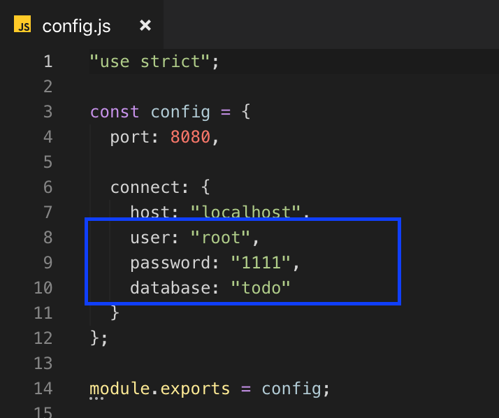
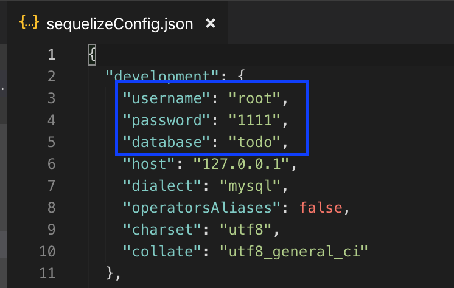

# react-todo-webapp

[구현 화면](http://110.10.189.209:3030/assets/video/react-todo-webapp.mp4)

## Getting Started

#### Run backend server

```bash
# Change to frontend root directory
cd /backend

# When use npm, install dependencies
npm install

# MY SQL DB 정보를 변경
cd /backend/config/config.js
cd /backend/config/sequelizeConfig.json

# 실행
node server.js
supervisor server.js
```

### `/backend/config/config.js` 변경 부분



### `/backend/config/sequelizeConfig.json` 변경 부분



#### Run front server

```bash
# Change to frontend root directory
cd /frontend

# When use yarn, install dependencies
yarn install

# When use npm, install dependencies
npm install

# 실행
yarn start
npm start
```

#### 실행

브라우저에서 http://localhost:3000/

### Project folder structure

```bash
kakaoIX-todo
├── frontend    -------> # frontend root
│   ├── public
│   ├── src     -------> # frontend source
│   └── node_modules
└── backend    -------> # backend root
    ├── config
    │   ├── config.js   -------> # change config
    │   └── sequelizeConfig.json  -------> # change config
    ├── controllers
    ├── models
    └── uploads -------> # excel upload files
```

---

## Rest API 구현목록

### TODO 조회

현재 등록된 todo 들 조회

```
GET /todos
Host: localhost:8080/todos
GET /todos?done={}&keyword={}&startdate={}&enddate={}&orderby={}&page={}
Host: localhost:8080/todos?done={}&keyword={}&startdate={}&enddate={}&orderby={}&page={}
```

- done: todo 완료여부( true=1, false=0 )
- keyword: 검색한 todo text
- startdate : 검색 시작 날짜
- enddate : 검색 완료 날짜
- orderby : 정렬 기준(createdAt, updatedAt)
- page: 조회할 페이지

특정 todo 조회

```
GET /todos/:id
```

- id: 조회할 todo의 id

### 참조관계 조회

현재 등록된 todo들 간의 참조관계 조회

```
GET /todos/relationship
```

특정 todo가 가지고 있는 참조관계 조회

```
GET /todos/:id/relationship
```

- id: 참조관계를 조회할 todo의 id

### 파일 다운로드

```
GET /todos/download/excel
```

### TODO 수정

특정 todo 정보 수정

```
PUT /todos/:id
```

- id: 수정할 todo의 id

특정 todo 완료상태 토글

```
PUT /todos/:id/done
```

- id: 완료상태를 토글할 todo의 id

### TODO 생성

새로운 todo 추가

```
POST /todos/new
```

엑셀 파일 업로드 후 데이터 추가

```
POST /todos/uploadfile
```

### TODO 삭제

특정 todo 삭제

```
DELETE /todos/:id
```

- id: 삭제할 todo의 id

### 참조관계 삭제

특정 참조관계 삭제

```
DELETE /todos/relation/children/:id
```

- id: 누군가를 참조하는 (과제 예시상에서는 todo 4) todo들 중 해당 id의 todo 가 지니고 있는 모든 참조관계 삭제

```
DELETE /todos/relation/parent/:id
```

- id: 누군가에게 참조 당하는 (과제 예시상에서는 todo 1,3) todo 들 중 해당 id의 todo 가 지니고 있는 모든 참조관계 삭제
